:::: hero
# Data and Modelling Infrastructure for Living Labs
::::

Welcome to the website of the Data and Modelling Infrastructure for Living Labs (DMI) Working Group. We are a service working group within the [Innovation Center for Agricultural System Transformation (IAT)](https://www.zalf.de/de/struktur/iat/Seiten/default.aspx) as part of the [Liebniz Center for Agricultural Landscape Research (ZALF)](https://www.zalf.de/de/struktur/iat/Seiten/default.aspx). Our mission is to support researchers and partners within the IAT with all things related to data and modelling. We have represented the different ways that we do this in the graphic below:

