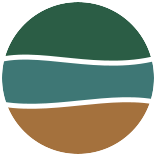

::: hero
[IAT Service Working Group]{.hero-eyebrow}

```{=html}

```

# Data and Modelling Infrastructure for Living Labs

[Discuss your project with us](mailto:benjaminsamuel.black@zalf.de){.btn-brand .dml-contact}
:::

Welcome to the website of the Data and Modelling Infrastructure for Living Labs (DML) Working Group. We are a service working group within the [Innovation Center for Agricultural System Transformation (IAT)](https://www.zalf.de/de/struktur/iat/Seiten/default.aspx) as part of the [Leibniz Centre for Agricultural Landscape Research (ZALF)](https://www.zalf.de/en/Pages/ZALF.aspx). Our mission is to support researchers and partners within the IAT with all things related to data and modelling. We have represented our three-pillared approach to this in the graphic below:

```{=html}
<div data-dml-concept-diagram data-lang="en" aria-label="Interactive concept diagram of the DML working group's three service pillars">
  <div class="dml-concept-fallback">
    <h3>Three pillars of our services</h3>
    <ul>
      <li><strong class="text-support">Support</strong> — Helping researchers manage their research data and software across every stage of a project: data management plans, version control, FAIR archiving, training and consulting.</li>
      <li><strong class="text-integration">Integration</strong> — Connecting research data and methods across working groups: shared infrastructure, interoperable methods and models, cross-group workflows, common standards.</li>
      <li><strong class="text-transfer">Transfer</strong> — Closing the loop between science and practice: dashboards and web tools, stakeholder co-design, Living Lab feedback loops, open-science communication.</li>
    </ul>
  </div>
</div>
```

::: {style="text-align: center"}
[Discuss your project with us](mailto:benjaminsamuel.black@zalf.de){.btn-brand .dml-contact}
:::

::: {.button-row}
[Our services](services.qmd){.btn-ghost}
[Meet the team](team.qmd){.btn-ghost}
:::


::: {.columns-divided}
::: {.column style="text-align: center"}
## News

::: {#news-listing}
:::

[All news →](news.qmd){.more-link}
:::

::: {.column style="text-align: center"}
## Projects

::: {#projects-listing}
:::

[All projects →](projects.qmd){.more-link}
:::
:::

