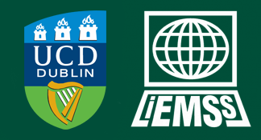

::: {.columns .columns-center}
::: {.column}
We are excited to announce that the DML group will host both a workshop and a hackathon at the
[International Environmental Modelling and Software Society (iEMSs) 2026 conference in Dublin](https://conference.iemss.org/) over the 12-16th July.

The workshop **"One Publishing Tool to Rule Them All: Quarto for Documentation, Presentations, Manuscripts and Outreach"**, which is being prepared in collaboration with researchers from [ETH Zurich](https://baug.ethz.ch/en/department/people/staff/personen-detail.MzE3MjU2.TGlzdC82NzksLTU1NTc1NDEwMQ==.html) will explore [Quarto](https://quarto.org/) as a unified solution for academic communication. Quarto can generate multiple output formats — PDF, HTML, LaTeX, and DOCX — from a single source document while supporting executable code in Python, R, Julia, and Observable. Through short presentations and guided exercises, participants will learn to produce documentation, reproducible journal articles, presentations, outreach websites, and interactive dashboards — all from one tool.

The Hackathon, prepared in collaboration with the Early Career Researcher Team within the [Open Modelling Foundation](https://www.openmodelingfoundation.org/) will have participants try to 'hack' existing models to improve their FAIRness with a special focus on re-useability.

We will make the content from both the workshop and hackathon available online after the conference, so stay tuned for more updates!

:::
::: {.column}
{width="100%" fig-alt="iEMSs 2026 logo" fig-align="center"}
:::
:::
