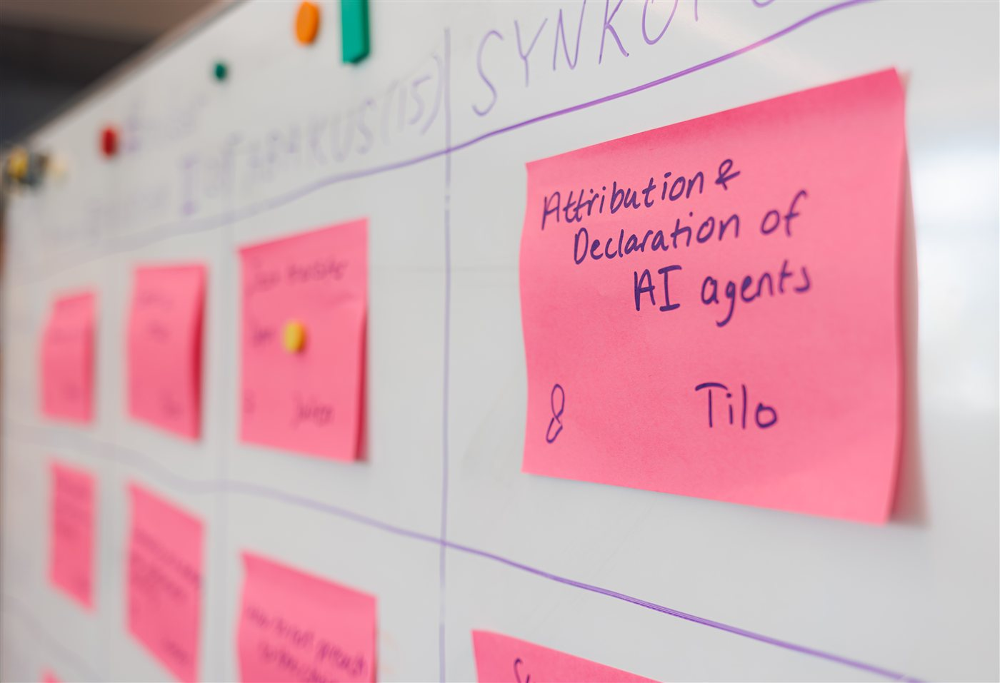
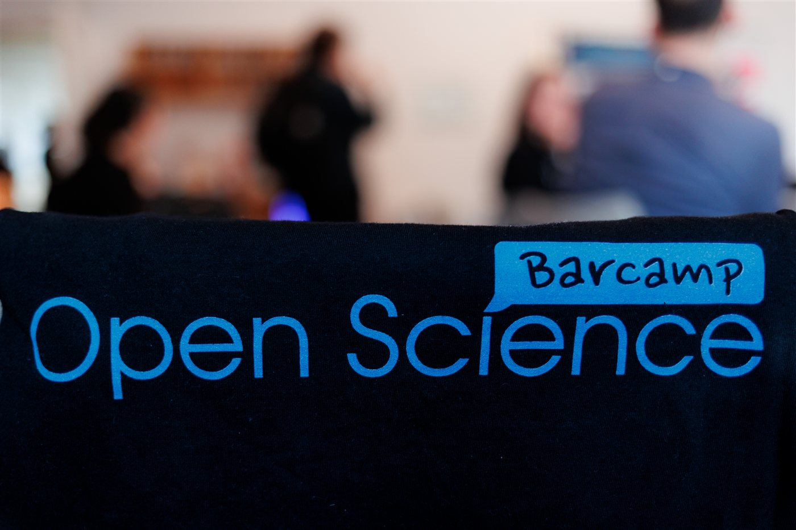

On 10 June we joined the 12th [Barcamp Open Science](https://www.barcamp-open-science.eu/) at Wikimedia Deutschland in Berlin, together with around 45 other participants from research institutions, libraries and infrastructure projects. This year the event ran under the heading of navigating challenging times, in recognition of the growing political and geopolitical pressure on open research practices.

A barcamp is an un-conference: the agenda is not fixed in advance, and participants propose and lead the sessions themselves. In practice this means far more discussion than presentation, which suits a topic like Open Science where practice differs so much between institutions and disciplines.

We proposed and moderated a session on effective "carrot and stick" approaches to incentivising Open Science in different institutional contexts. The discussion was honest about how little the current incentives achieve. Career benefits that are promised for open practices rarely materialise, and funder mandates such as data management plans are often not checked for compliance. Participants also described a reluctance to publish data out of concern that imperfections would become visible. The conclusion was that both carrots and sticks are still needed, but that neither will work without a broader cultural shift — including, in the spirit of George Box, accepting that all data are imperfect but some data are useful.

Other sessions covered the role of open research in supporting democratic values, the attribution of AI-generated data, and open educational resources. The organising team has now published a wrap-up of the whole event, which DML contributed to: [Barcamp Open Science 2026: Navigating Challenging Times](https://www.zbw-mediatalk.eu/2026/07/barcamp-open-science-2026-navigating-challenging-times/).

We would like to thank the organising team from the Leibniz Strategy Forum Open Science and Wikimedia Deutschland for hosting, and we would recommend the barcamp format to anyone at IAT or in the Living Labs whose work touches on Open Science. We are looking forward to the next one.

::: {layout-nrow="1"}
{fig-alt="A whiteboard session grid filled with pink sticky notes proposing sessions, one reading 'Attribution and Declaration of AI agents'." group="barcamp"}

{fig-alt="A Barcamp Open Science t-shirt in the foreground with participants talking in the background." group="barcamp"}
:::

*Photos from Barcamp Open Science 2026, attribution: Ralf Rebmann 2026.*
