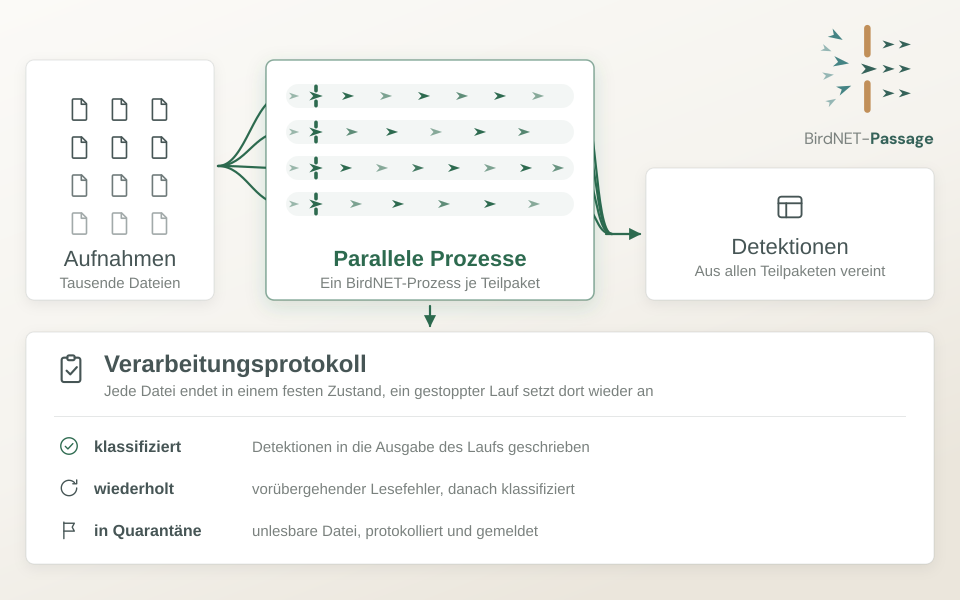

::: {.callout-note title="Bald verfügbar"}
Der Code von BirdNET-Passage wird derzeit für die erste versionierte Veröffentlichung vorbereitet, die wir in Kürze erwarten. Bis dahin ist der Code noch nicht öffentlich zugänglich. Wenn Sie Interesse an der Nutzung haben, [melden Sie sich gern bei uns](mailto:iat-dml@zalf.de). Wir geben Ihnen Bescheid, sobald er verfügbar ist.
:::

BirdNET-Passage ist eine Forschungssoftware, die die DML-Gruppe für [Marie Perennes](https://www.zalf.de/de/ueber_uns/mitarbeiter/Seiten/perennes_m.aspx) entwickelt. Sie wendet [BirdNET-Analyzer](https://github.com/birdnet-team/BirdNET-Analyzer), ein KI-Modell, das Vogelarten anhand ihrer Rufe und Gesänge erkennt, auf sehr große Sammlungen von Audioaufnahmen an. Ziel von BirdNET-Passage ist nicht nur, dass Tausende Dateien schnell verarbeitet werden, sondern auch robust: Die Software hält den Zustand jeder Datei fest, geht kontrolliert mit Fehlern um und ermöglicht es, einen unterbrochenen Lauf wiederherzustellen und fortzusetzen.

{fig-alt="Tausende Sensoraufnahmen werden auf vier parallele BirdNET-Prozesse verteilt und zu einer einzigen Tabelle mit Detektionen zusammengeführt. Ein Verarbeitungsprotokoll hält das Ergebnis jeder Datei fest: klassifiziert, nach einem vorübergehenden Lesefehler wiederholt oder als unlesbar in Quarantäne. Ein gestoppter Lauf setzt am Protokoll wieder an, statt von vorn zu beginnen." fig-align="center"}

## Die Herausforderung

Akustische Sensoren sind ein einfacher Weg, Vögel in einer Landschaft zu erfassen. An mehreren Untersuchungsstandorten aufgestellt, nehmen sie rund um die Uhr auf und erzeugen jeden Monat mehrere Terabyte kurzer Audiodateien. Jede dieser Dateien muss klassifiziert werden, bevor die Daten etwas darüber aussagen, welche Arten wann und wo vorkommen.

Bisher wurden die Aufnahmen stapelweise mit der BirdNET-Desktopanwendung verarbeitet. Das funktioniert, läuft aber immer nur einen Stapel nach dem anderen ab, und eine einzelne Sammlung konnte ein bis zwei Wochen dauern. Brach ein Lauf mittendrin ab, ließ sich nur schwer feststellen, welche Dateien bereits verarbeitet waren und welche nicht.

## Was DML beigetragen hat

Wir haben BirdNET-Passage als R-basierte Pipeline entwickelt, damit sie zu den Werkzeugen passt, die die Gruppe bereits nutzt. Eine einzige Konfigurationsdatei beschreibt den Lauf, und ein einziger Befehl verarbeitet die gesamte Sammlung. Die Software:

- **Arbeitet parallel.** Die Sammlung wird in Teilpakete aufgeteilt, und jedes Teilpaket wird gleichzeitig von einem eigenen BirdNET-Prozess klassifiziert.
- **Führt ein Verarbeitungsprotokoll.** Jede Datei endet in einem festgehaltenen Zustand: klassifiziert, nach einem vorübergehenden Lesefehler wiederholt oder als unlesbar zurückgestellt.
- **Setzt dort wieder an, wo sie aufgehört hat.** Wird ein Lauf unterbrochen, geht es anhand des Protokolls weiter, statt von vorn zu beginnen. Bereits verarbeitete Dateien kosten keine Zeit mehr.
- **Ermöglicht gezielte Wiederholungen.** Ausgewählte Dateien können bewusst erneut verarbeitet werden, zum Beispiel mit neuen Einstellungen, ohne den Rest zu berühren.
- **Führt die Ergebnisse zusammen.** Die Detektionen aus allen Teilpaketen werden zu einer Tabelle für den gesamten Lauf vereint.

## Stand

Die Pipeline für den Desktop-Rechner ist umgesetzt und getestet. Derzeit richten wir die Unterstützung für den Hochleistungsrechner-Cluster (HPC) des ZALF ein, damit große Sammlungen auf deutlich mehr Prozessoren verteilt werden können, als ein einzelner Computer bietet.

Neben der Verarbeitung besprechen wir mit der Gruppe auch, wie die Rohaufnahmen langfristig archiviert werden können. Zu beidem berichten wir mehr, sobald die erste Version veröffentlicht ist.

Wenn Ihre Gruppe mit akustischen Monitoringdaten arbeitet oder vor einer ähnlichen Aufgabe steht, ein Modell auf sehr viele Dateien anzuwenden, [sagen Sie uns gern Bescheid](mailto:iat-dml@zalf.de).
