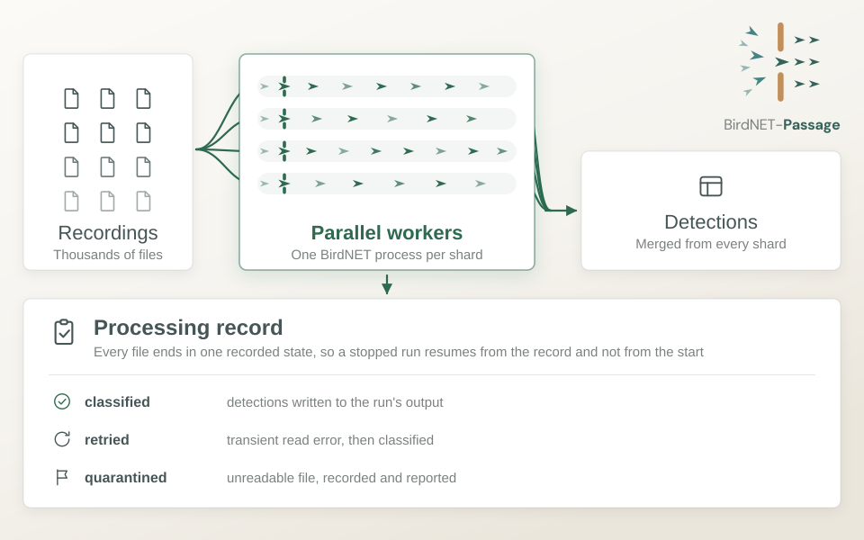

::: {.callout-note title="Coming soon"}
The BirdNET-Passage codebase is being prepared for its first versioned release, which we expect very soon. Until then, the code is not yet publicly accessible. If you are interested in using it, please [get in touch](mailto:iat-dml@zalf.de) and we will let you know when it is available.
:::

BirdNET-Passage is research software, developed by the DML group for [Marie Perennes](https://www.zalf.de/de/ueber_uns/mitarbeiter/Seiten/perennes_m.aspx), that runs, [BirdNET-Analyzer](https://github.com/birdnet-team/BirdNET-Analyzer), an AI model that identifies bird species from their calls and songs, over very large collections of audio recordings. The aim of BirdNET-Passage is not just to make sure that thousands of files can be processed quickly, but also robustly in the sense that it records the status of each file, handles errors gracefully and allow for recovery and resumption. 

{fig-alt="Thousands of sensor recordings are fanned out across four parallel BirdNET workers and merged into a single detections table. A processing record notes the outcome of every file: classified, retried after a transient read error, or quarantined as unreadable. A stopped run resumes from the record rather than from the start." fig-align="center"}

## The challenge

Acoustic sensors are a simple way to monitor birds across a landscape. Placed at several field sites, they record around the clock and produce several terabytes of short audio files every month. Each of these files needs to be classified before the data can say anything about which species are present, where and when.

Until now, the recordings were processed in batches through the BirdNET desktop application. This works, but it runs one batch at a time, and a single collection could take one to two weeks to finish. If a run stopped partway through, it was hard to tell which files were already done and which were not.

## What DML contributed

We built BirdNET-Passage as an R-first pipeline, so that it fits the tools the group already uses. A single configuration file describes the run, and one command processes the whole collection. The software:

- **Runs in parallel.** The collection is split into shards, and each shard is classified by its own BirdNET process at the same time.
- **Keeps a processing record.** Every file ends in one recorded state: classified, retried after a temporary read error, or set aside as unreadable.
- **Resumes where it stopped.** If a run is interrupted, it continues from the record instead of starting again, and it does not spend time on files that are already done.
- **Allows controlled reruns.** Selected files can be processed again on purpose, for example with new settings, without touching the rest.
- **Merges the results.** Detections from all shards are combined into one table for the whole run.

## Status

The desktop pipeline is implemented and tested. We are now bringing up support for the ZALF high-performance computing (HPC) cluster, so that large collections can be spread across many more processors than a single computer offers.

Alongside the processing, we are also discussing with the group how the raw recordings can be archived for the long term. We will share more on both once the first release is out.

If your group works with acoustic monitoring data, or faces a similar problem of running a model over many files, please [let us know](mailto:iat-dml@zalf.de).
