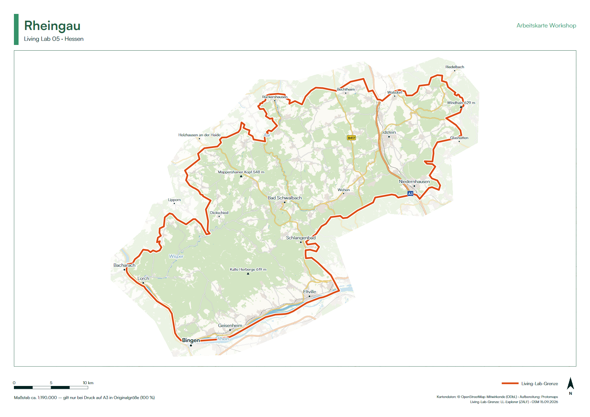
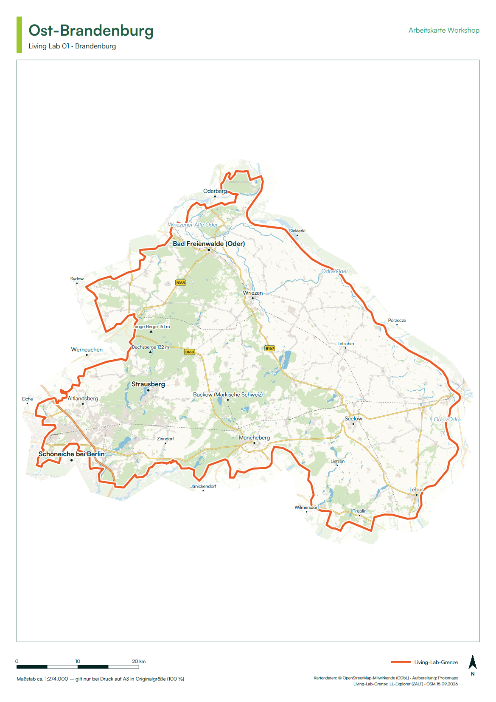
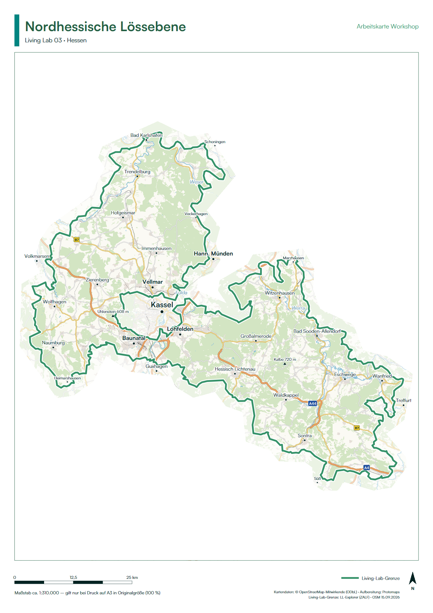
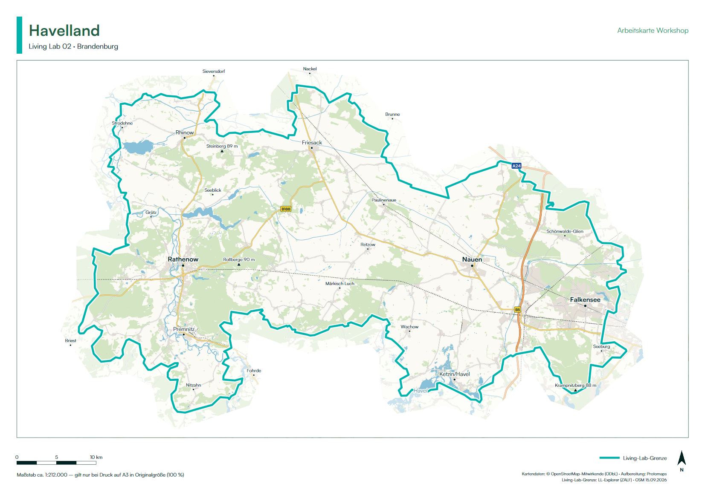
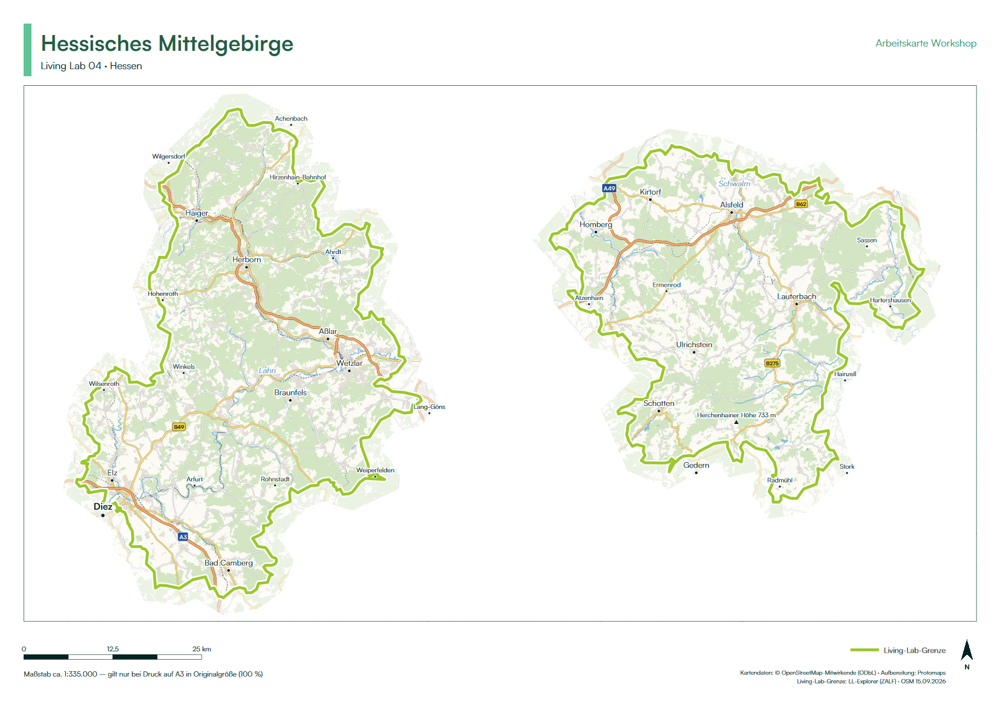

Living Lab workshops often need a simple question answered on paper: where? Where do stakeholders farm, where are water problems felt, where could a new measure be tested? To support this, we built a set of print-ready A3 base maps, one for each of the five IAT Living Labs. IAT staff and researchers can print them and bring them to workshops, stakeholder meetings and events.

{fig-alt="A3 workshop map of the Rheingau Living Lab: a pale OpenStreetMap basemap with the Living Lab boundary in orange, a small number of place and river labels, a header with the Living Lab name, and a scale bar and attribution in the footer" fig-align="center"}

## What each map shows

The maps are kept deliberately quiet, so that there is room to draw and write on them. Each sheet shows:

- **A basemap from OpenStreetMap**, with land use, forests, water, railways and roads. It is drawn from vector data, so it stays sharp when printed at A3.
- **The Living Lab boundary.** The map is shown at full strength inside the boundary and fades out in a light ring around it.
- **A small number of labels**: cities and towns, larger villages, motorway and federal road numbers, major rivers, large lakes and the highest peaks. Labels that would crowd each other are left out.
- **A header, scale bar, scale statement, north arrow and data attribution.**

Each map is printed in landscape or portrait format, whichever shows the region at the larger scale. The sheets are available in German or English.

::: {layout="[[1,1],[1],[1]]"}
{fig-alt="A3 portrait workshop map of the East Brandenburg Living Lab" group="base-maps"}

{fig-alt="A3 portrait workshop map of the North Hessian Loess Plain Living Lab" group="base-maps"}

{fig-alt="A3 landscape workshop map of the Havelland Living Lab" group="base-maps"}

{fig-alt="A3 landscape workshop map of the Hessian Low Mountain Range Living Lab" group="base-maps"}
:::

## Using the maps in your workshop

If you are planning a workshop or event, [get in touch with us](mailto:iat-dml@zalf.de) and we will send you the print package for your Living Lab. It contains the A3 PDFs, a short text file with printing instructions, and the data behind each map.

When printing, please keep two things in mind:

- **Print on A3 at 100 % ("actual size").** Do not use "fit to page". The scale bar and scale statement are only correct at actual size.
- **Keep the attribution on the map.** The map data comes from © [OpenStreetMap contributors](https://www.openstreetmap.org/copyright) under the ODbL, with vector tiles from [Protomaps](https://protomaps.com). This must stay on any copy.

Colour printing on matte paper works best, as it is easier to write on.

## How the maps are made

The maps are produced by a single R script, available in the public GitHub repository [iat-dml/living-labs-base-maps](https://github.com/iat-dml/living-labs-base-maps). For each Living Lab, the script downloads a regional extract of current OpenStreetMap data, chooses the paper orientation and scale, selects labels that do not overlap, and writes a vector PDF. A full run for all five Living Labs takes about three minutes.

The Living Lab boundaries come from the [Living Lab Explorer](living-lab-dashboards.qmd), so the workshop maps and the online dashboards show the same areas. Alongside each PDF, the script also saves the boundary, the placed labels and the OpenStreetMap extract. These can be opened in QGIS, for example to add your own layers or restyle a map.

If you would like a map for a different area, in a different format, or with additional information such as study sites, please [let us know](mailto:iat-dml@zalf.de).
