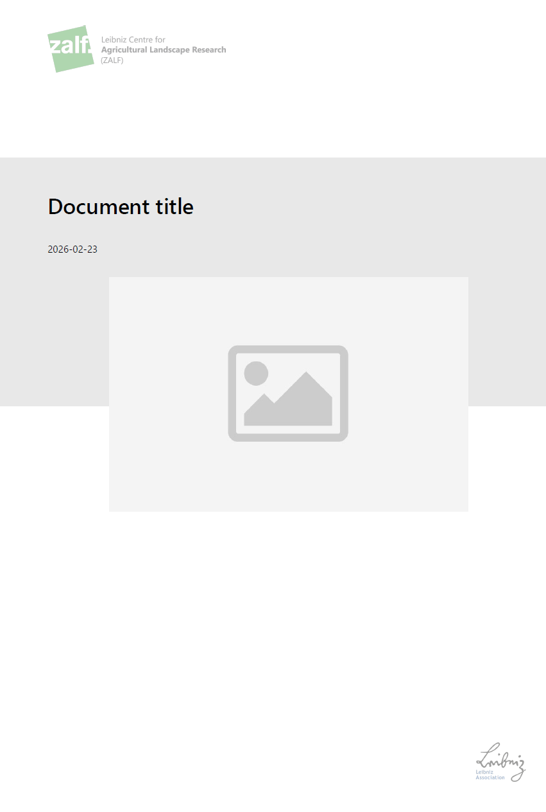
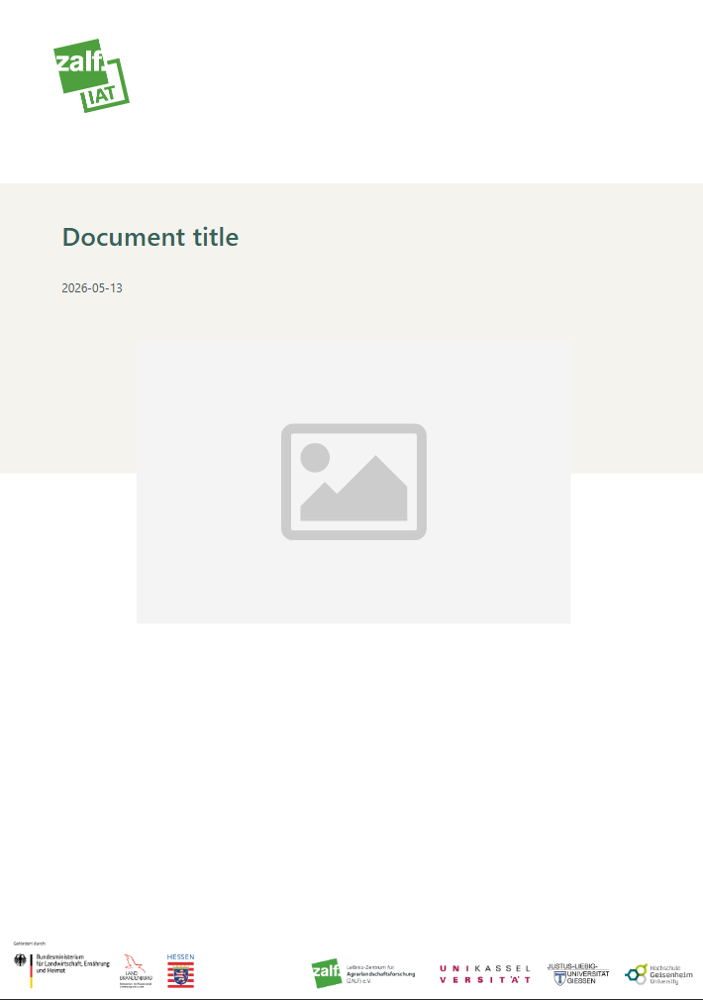
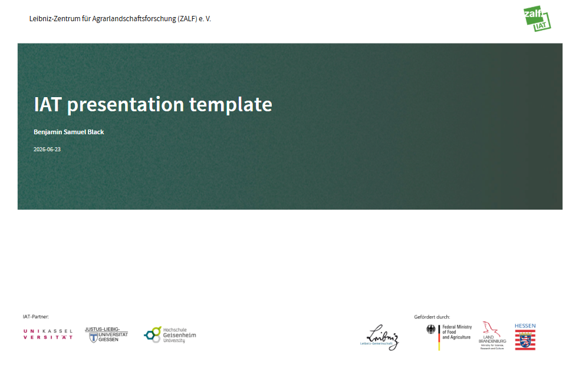
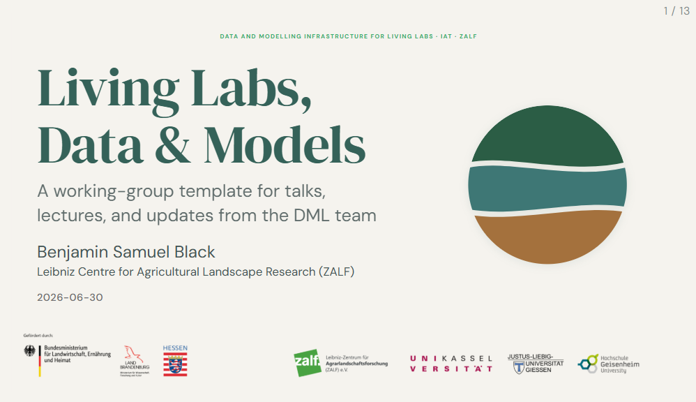

This project delivered a collection of reusable document and presentation templates for the IAT working groups, covering both technical publishing pipelines ([Quarto](https://quarto.org) extensions) and traditional office formats (PowerPoint). All templates are available in a public GitHub repository at [https://github.com/iat-dml/templates](https://github.com/iat-dml/templates).

## Quarto Extensions

The core deliverables are four Quarto extensions that can be installed directly from the repository and used in any Quarto project. They are self-contained — logos, colour palettes, and fonts are all bundled inside the `_extensions/` folder, so documents render consistently regardless of the local environment.

### ZALF Internal Documents

A [Quarto Typst](https://quarto.org/docs/output-formats/typst.html) extension that renders `.qmd` files as branded ZALF PDF documents. The cover page places the ZALF and Leibniz Association logos at the top and bottom respectively, with a grey band across the middle carrying the document title, date, and an optional cover image. Subsequent pages use running headers, styled H1–H4 headings, coloured bullet lists, and striped tables — all drawn from the official ZALF green palette (`#46A84F`).

{fig-alt="Cover page showing the ZALF logo, document title, date, and Leibniz Association logo"}

```bash
quarto use template iat-dml/templates/zalf-internal-typst
```

### IAT Internal Documents

A companion Typst extension for IAT internal PDF documents. It follows the same cover-page and body layout as the ZALF template but swaps in the IAT brand palette, the combined ZALF/IAT logo, and a branded footer banner with partner and funder logos.

{fig-alt="Cover page showing the IAT logo, document title, date, and a row of partner and funder logos"}

```bash
quarto use template iat-dml/templates/iat-internal-typst
```

### IAT Presentations

A [Quarto Revealjs](https://quarto.org/docs/presentations/revealjs/) extension for branded IAT HTML slide decks. The title slide uses a deep forest-green hero panel with white headings and the ZALF/IAT logo in the top-right corner. A full-width footer bar carries partner university logos and funder marks, ensuring compliance with grant acknowledgement requirements out of the box.

{fig-alt="Title slide in dark green with IAT logo, presentation title in white, and a logo bar along the bottom"}

```bash
quarto use template iat-dml/templates/iat-revealjs
```

### DML Presentations

A Revealjs extension styled for the Data and Modelling Infrastructure (DML) working group. The theme reflects the DML visual identity: DM Serif Display for large headings, DM Sans for body text, a warm off-white paper background, and a teal-dark primary colour with green and olive accents. A persistent DML circular mark appears in the lower-right corner of every content slide and hides automatically in PDF exports.

{fig-alt="Title slide with large serif heading, DML circular mark, and a funder logo bar along the bottom"}

```bash
quarto use template iat-dml/templates/dml-revealjs
```

## PowerPoint Templates

Three branded PowerPoint templates are included for users who prefer traditional slide software:

- **DML** — `dml-template-powerpoint.potx`
- **IAT** — `iat-template-powerpoint.pptx`
- **ZALF** — `zalf-template-powerpoint-slides.pptx`

## Meeting Agenda & Minutes

A Markdown template (`agenda-minutes-template.md`) is provided for structured bi-weekly service working group meeting notes, covering working group updates, management updates, and action items.
